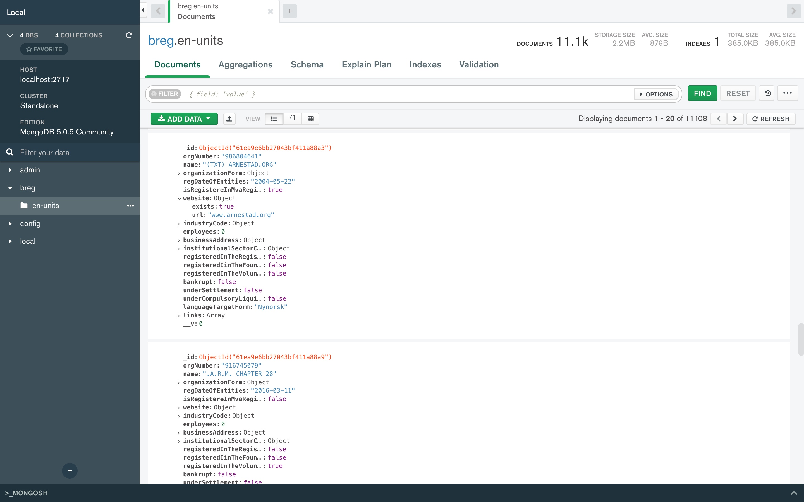

# Noxintel
Get datasets of businesses in Scandinavia from government APIs, scrape data from websites, 

# What it does
It streams GZIP files that contains huge amounts of data and inserts that data in MongoDB. What you can do with this data is up to you. I'm planning on introducing a couple of features that allows us to scrape data from websites and get valuable information that can be used to contact a business and offer services to fix problems,collect leads, or general data for market research purposes.

My idea before was to use APIs from google to gather statistical data from each website. However, I believe there are multiple open source alternatives, at least for some of the APIs that I can integrate into this project. (To be updated)

Extract more data from the URLs with these APIs.
- [Google adwords API](https://developers.google.com/adwords/api/docs/guides/start)
- [Google business API](https://developers.google.com/my-business/reference/rest)
- [Google lighthouse API](https://developers.google.com/web/tools/lighthouse)
- [Google Pagespeed insight API](https://developers.google.com/speed/docs/insights/v5/reference/)
- [Google webrisk API](https://cloud.google.com/web-risk/docs/reference/rest/)
- [Google Web Security Scanner API](https://cloud.google.com/security-scanner/docs/reference/rest/)
- [Google Safe Browsing API](https://developers.google.com/safe-browsing/v4/reference/rest/)
- [Google alert API](https://developers.google.com/admin-sdk/alertcenter)
- [Wappalyzer API](https://www.npmjs.com/package/wappalyzer)
- [Linkedin API](https://developer.linkedin.com/)
- [Crunchbase API](https://data.crunchbase.com/docs/using-the-api)

## Prerequisites
- [Docker](https://www.docker.com/products/docker-desktop)
- [Mongo DB](https://docs.mongodb.com/manual/installation/)
- [MongoDB Compass (Interface for MongoDB)](https://www.mongodb.com/try/download/compass)
- [Node](https://nodejs.org/en/download/)
- [Yarn](https://classic.yarnpkg.com/lang/en/docs/install/#mac-stable)
- Min 8 GB Ram 

### Setup
Run `yarn setup` from root folder

Yarn setup will:
- Install all dependencies for the project
- Create a ENV file in packages/server
- Pull a MongoDB docker container

### Start the DB
`yarn db`

### Start the server
`yarn dev`

### Build
`yarn build:server`

### Todo
- [ ] Add more countries
- [ ] Build a user interface
- [ ] Implement webcrawlers
- [ ] Build APIs